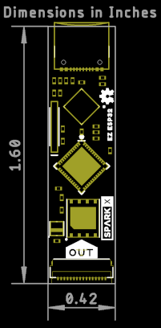

# SparkX smôl ESP32

[*SparkX smôl ESP32 (SPX-18619)*](https://www.sparkfun.com/products/18619)

The ESP32 in smôl format:
- ESP32 Processor
- WiFi antenna
- RTC crystal
- WS2812 RGB LED
- WS25Q128 128Mb Flash memory
- USB-C connector
- CP2102N USB-UART interface with RESET and BOOT control

## Repository Contents

- **/examples** - Example code for the Arduino IDE
- **/Documentation** - Datasheets etc.
- **/Hardware** - Eagle design files
- **LICENSE.md** contains the licence information

## Product Versions

- [SPX-18619](https://www.sparkfun.com/products/18619) - Original SparkX Release.

## License Information

This product is _**open source**_!

Please review the LICENSE.md file for license information.

If you have any questions or concerns on licensing, please contact technical support on our [SparkFun forums](https://forum.sparkfun.com/viewforum.php?f=123).

Distributed as-is; no warranty is given.

- Your friends at SparkFun.
